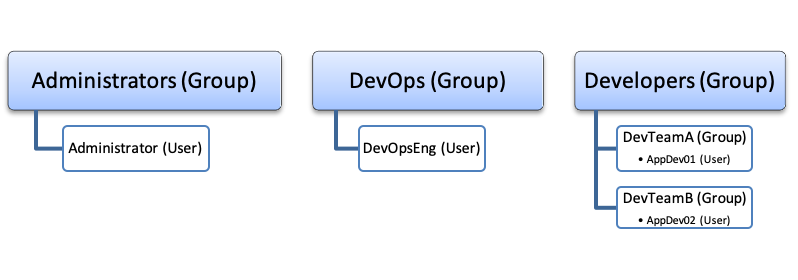

# Tanzu Advanced Proof of Concept (PoC) Test Plan
This PoC test plan and evaluation process focuses on demonstrating functional operation, capabilities, and features of the Tanzu Advanced product suite.

**IMPORTANT** - This pre-sales offering does not consider all best practices and recommendations for production or extended pilot use.  VMware strongly encourages Customers to thoroughly review all publicly available product documentation and engage with the Professional Services Organization and Partners before going forward with any production design decisions. The PoC evaluation system is not the appropriate platform for intensive and lengthy performance testing and evaluation.

## Intended Audience

This guide is for cloud architects, engineers, administrators, and developers whose organization has an interest integrating Tanzu Advanced components and platform into their multi-cloud strategy and environments.

## System Users and Roles

>NOTE: BEFORE PROCEEDING TO THE TEST CASES, READ THIS SECTION IN ITS ENTIRETY AS IT INCLUDES PREPARATIONS AND PREREQUISITES REQUIRED TO SUCCESSFULLY RUN THE TEST CASES.

The test approach bases the test scenarios and executing the test procedures from the perspective of standard operations and developments roles. System user accounts or groups of users map to symbolizing roles defined within the vSphere 7 with Tanzu platform and Kubernetes clusters. Following user authentication, a user’s role association determines his/her level of authorization and entitlements while interacting with the interfaces and system resources.

vSphere 7 with Tanzu integrates with vCenter Single Sign-On (SSO), which is an authentication broker and security token exchange infrastructure, for authenticating system users and authorizing access to system resources. vCenter SSO supports multiple identity sources including local domain, Active Directory, and LDAP. Securing access control for vSphere 7 with Kubernetes requires applying privilege policies at multiple layers in the stack. Executing this test plan requires establishing user accounts and groups in the vCenter SSO local domain and/or linked identity source(s). The following image provides a conceptual representation of how the test plan organizes users and groups membership. Additional information on configuring [Identify Sources for vCenter Server with vCenter Single Sign-On is available on VMware Docs](https://docs.vmware.com/en/VMware-vSphere/7.0/com.vmware.vsphere.authentication.doc/GUID-1F0106C9-0524-4583-9AC5-A748FD1DC4C5.html).

### vSphere Administrator

As a vSphere administrator, the primary interface for interacting with the vSphere with Kubernetes platform is the vSphere Client. At a high level, vSphere Administrators’ responsibilities involve configuring a Supervisor Cluster and namespaces, where DevOps engineers can deploy Kubernetes workloads. vSphere Administrators should have excellent knowledge about the vSphere and NSX-T technologies, and basic understanding about Kubernetes.

Test cases involving the vSphere administrator role require at least one (1) user account that is either a member of the vCenter SSO, Administrators group or mapped to a vCenter role with the following privileges and permissions for the participating vSphere cluster(s).

* **Namespaces.Modify cluster-wide configuration** or **Namespaces.Modify namespace configuration**
* **Profile-driven storage. Profile-driven storage view** and **update**
* **vSphere Tagging.Create vSphere Tag** on the root vCenter Server instance
* **vSphere Tagging.Create vSphere Tag** Category on the root vCenter Server instance
* **vSphere Tagging.Assign** and **Unassign vSphere Tag** on the root vCenter Server instance
* **Content Library.Create subscribed library** or **Content Library.Create local library**
* **Datastore.Allocate space** on the destination datastore

For additional details, reference [Authentication for vSphere with Kubernetes](https://docs.vmware.com/en/VMware-vSphere/7.0/vmware-vsphere-with-kubernetes/GUID-93B29112-4492-431F-958A-12323540C38D.html)

### DevOps Engineer

A DevOps engineer might be a Kubernetes developer and an application owner, a Kubernetes administrator, or combine functions of both. A DevOps engineer uses kubectl commands to deploy vSphere Pods and Tanzu Kubernetes clusters within existing namespaces on the Supervisor Cluster. Typically, a DevOps engineer does not need to be an expert on vSphere and NSX-T but has basic understanding about these technologies and the vSphere 7 with Kubernetes platform to interact with the vSphere administrators more efficiently.

Test cases involving the DevOps engineer role require at least one (1) user account. The recommendation is to create a group such as one named DevOps in the identity source and add individual user accounts as members to the group.  After enabling a vSphere cluster as a Supervisor cluster and creating a namespace, the vSphere administrator will have the ability to entitle the DevOps engineer with namespace-level permissions.  There are two types of permissions, edit and view. This test plan requires the DevOps engineer to maintain edit permissions across namespaces. With the namespace edit permission entitlement, the DevOps engineer will automatically receive cluster-admin privileges for all TKG cluster deployed within the namespace, respectively.

### Application Developer

Application developers translate business and product objectives into application code. They administer the application development life cycle through CI/CD pipeline automation and an assortment of product integrations. They connect to a Tanzu Kubernetes cluster and use kubectl commands or other tools such as Helm or Jenkins to deploy workloads, including pods, services, load balancers, and other resources.

Test cases involving the application developer role require at least two (2) user accounts. The recommendation is to create two (2) groups such as DevTeamA and DevTeamB in the identity source and add individual user accounts as members to the groups.  After the DevOps engineer deploys a TKG cluster, the DevOps engineer will have the ability to entitle the application developer with permissions to the TKG cluster through standard Kubernetes RBAC policies.

## Test Environment

>NOTE: BEFORE PROCEEDING TO THE TEST CASES, READ THIS SECTION IN ITS ENTIRETY AS IT INCLUDES PREPARATIONS AND PREREQUISITES REQUIRED TO SUCCESSFULLY RUN THE TEST CASES.

The test cases within this document assume that the installation of vSphere 7 with Tanzu and NSX-T are complete and deployed to an infrastructure prepared according to the requirements detailed in the "VMware vSphere 7 with Tanzu PoC Prerequisites and Preparations Guide." Additionally, it assumes that the Customer engaged with a VMware Systems Engineer for the vSphere 7 with Tanzu PoC design and installation.  The following subsections identify the environment expectations, software and tools required for effectively conducting the test and evaluation process.

TODO[fcarta] - Add info about Tanzu SaaS (TMC,TO,TAC,TSM)

### VMware Software Build Information

For the deployed vSphere 7 with Tanzu PoC environment, populate the following table with the system components’ version and build number.

TODO[fcarta] - Update BOM with correct versions
Software Product | Version | Build
--- | --- | --- |
VMware Cloud Foundation | 4.2.1 | |
VMware vSphere ESXi | 7.0.1d |  |
VMware vCenter | 7.0.1d |  |
VMware NSX-T | 3.1.0 |  |
vRealize Operations Manager |   |   |
vRealize LogInsight |   |   |

### Software Test Tools
TODO[fcarta] - add management container instructions / workshop instructions

### Test-Cases-Inventory
#### Operator SC01: Operate and Manage Kubernetes Infrastructure

Test Case ID | Test Case Description |
--- | --- |
[SC01-TC01](scenarios/operator/sc01-tc01.md) | Enable a vSphere Cluster for Kubernetes Workloads |
[SC01-TC02](scenarios/operator/sc01-tc02.md) | Create and Configure a Supervisor Cluster Namespace(s) with RBAC |
[SC01-TC03](scenarios/operator/sc01-tc03.md) | Create and Configure a Supervisor Cluster Namespace(s) with Resource Limitations |
[SC01-TC04](scenarios/operator/sc01-tc04.md) | Supervisor Cluster Control Plane Access and Logging |

#### DevOps SC02: Provision and Manage Kubernetes Workload Clusters

Test Case ID | Test Case Description |
--- | --- |
[SC02-TC01](scenarios/devops/sc02-tc01.md) | Provision a Tanzu Kubernetes Cluster Using the Tanzu Kubernetes Grid Service |
[SC02-TC02](scscenarios/devops/sc02-tc02.md) | Apply RBAC to a Tanzu Kubernetes Grid Cluster and Granting Developer Access |
[SC02-TC03](scenarios/devops/sc02-tc03.md) | Use Pod Security Policies with a Tanzu Kubernetes Cluster(s) |
[SC02-TC04](scenarios/devops/sc02-tc04.md) | Create Guest Cluster |
[SC02-TC05](scenarios/devops/sc02-tc05.md) | Create Guest Cluster Mission Control ??? |
[SC02-TC06](scenarios/devops/sc02-tc06.md) | Configure Guest Workload Cluster for Logging with Tanzu Extension of Fluentbit |
[SC02-TC07](scenarios/devops/sc02-tc07.md) |  |
[SC02-TC08](scenarios/devops/sc02-tc08.md) | Service Mesh Lifecycle Management |
