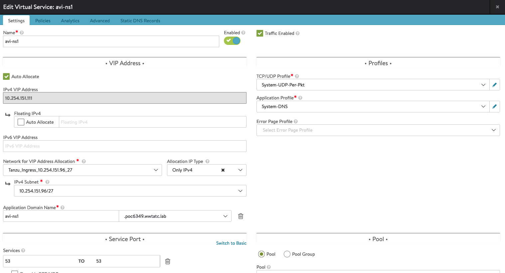

# 2. Provide delegated DNS for applications hosted in kubernetes clusters

### Success Criteria: 
Cluster should provide tooling for automatic creation of DNS resources in a cloud native way.

### Workflows
This test case contains two different ways to manage DNS
* [Using AVI](#dns-delegation-with-nsx-advanced-loadbalancer-avi)
* [Using External DNS](#dns-delegation-tanzu-service-discovery-extension)

---------------------

## DNS delegation with NSX Advanced Loadbalancer (AVI)

### Requirements

* Tanzu Kubernetes Workload Cluster created
* Avi AKO Operator installed
* Avi Controller deployed and configured
* Avi admin access

### Test Procedure

1. Log into the Avi UI as admin
2. From the handburger icon in the top-left corner. Select "Administration"
3. Select "Settings" from the top level ribbon
4. Select "DNS Service" from the secondary ribbon
5. Select "+ Add Virtual Service"
6. Complete the DNS Service configuration accordingly, taking note of "Application Domain Name" service
   1. For example:

7. Deply the hello-world application
   ```execute
   kubectl apply -f ./hello-world.yaml
   ```
8. Open the hello-world ingress file and replace `avi-ns1.poc6349.wwtatc.lab` with the value from step 6
9. Deploy the ingress manifest for hello-world
    ```execute
    kubectl apply -f ./hello-world-ingress.yaml
    ```
10. Retrieve the newly created ingress resource and wait for an IP Address to be assigned
    ```execute
    kubectl get ing -w
    ```
11. Perform an NSlookup to ensure the host has been added in DNS 
    *note: this may take a couple minutes for DNS to propogate*
    ```script
    nslookup helloworld.avi-ns1.poc6349.wwtatc.lab
    ```
### Status Pass/Fail
 
* [  ] Pass
* [  ] Fail

## DNS delegation Tanzu Service Discovery Extension

### Requirements 
 
* Tanzu Kubernetes Workload Cluster deployed
* Cluster-Admin access to k8s cluster
* Supported DNS provider (RFC2136 BIND, Route53, Azure)

### Test Procedure

1. Install the External DNS provider from the Tanzu Extension via the documentation [here](https://docs.vmware.com/en/VMware-Tanzu-Kubernetes-Grid/1.3/vmware-tanzu-kubernetes-grid-13/GUID-extensions-external-dns.html#).
2. Deply the hello-world application
   ```execute
   kubectl apply -f ./hello-world.yaml
   ```
3. Validate external DNS using the steps outlined [here](https://docs.vmware.com/en/VMware-Tanzu-Kubernetes-Grid/1.3/vmware-tanzu-kubernetes-grid-13/GUID-extensions-external-dns.html#validating-external-dns-7).

### Status Pass/Fail
 
* [  ] Pass
* [  ] Fail
----------------------